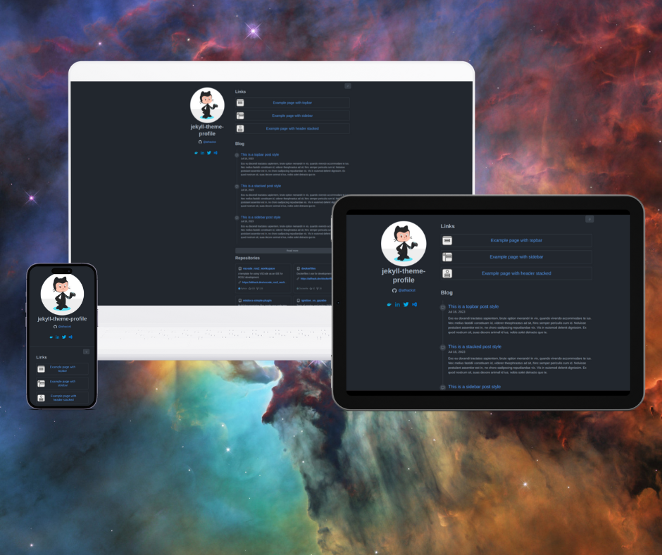
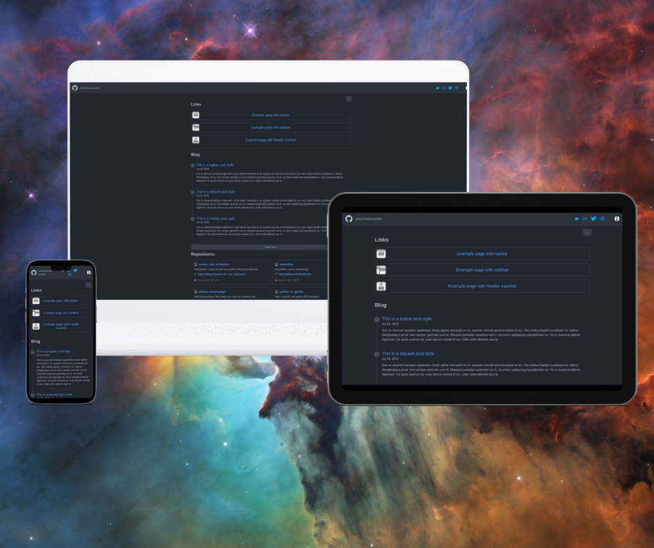

This theme can be set up using the `_config.yml` file, most settings can be overwritten in pages.

## Theme settings

### Setting the theme

```yaml
theme: jekyll-theme-profile
```

### Customizing the theme

#### Set the style of the website

Select the default style for your theme by adding `style` to your config file:

```yaml
style: sidebar # One of "stacked", "sidebar", "topbar", "appbar"
```

You can also set the style of a particular page by adding `style` to your frontmatter.

```yaml
---
style: sidebar # One of "stacked", "sidebar", "topbar", "appbar
---
```

##### [Sidebar](../sidebar.md)



##### [Stacked](../stacked.md)


##### [Topbar](../topbar.md)



##### [Appbar](../appbar.md)


Choosing the right style helps define the user experience and visual flow

#### Setting user avatar

By default, the theme will use your github avatar.  You can, however, set a custom avatar for your site

```yaml
user_image: /assets/img/user-image.jpg
```

#### Customizing light and dark themes

This setting specifies the style for the light and dark modes of your site.  These styles are taken from [primer css](https://primer.style/css/storybook/?path=/docs/support-theming--docs).

```yaml
# The themes to use for dark and light
dark_theme: dark_dimmed
light_theme: light
```

#### Set a custom background and image overlay

You can even change the background by adding the following to your `_config.yml` file.

```yaml
background:
  image: /media/background-img.jpg
  overlay: rgba(0, 0, 0, 0.5) # Overlay for both light and dark styles
```

or set custom overlays for the light and dark themes.

```yaml
background:
  image: /media/background-img.jpg
  light: # custom overlay for light and dark styles
    overlay: rgba(255, 255, 255, 0.5)
  dark:
    overlay: rgba(0, 0, 0, 0.5)
```

[Example page](../custom-background.md){:.btn}

#### Set custom header colors

You can change the header color by adding the following to your `_config.yml` file or page frontmatter.

```yaml
header:
  color: "#4051b5"
  text: "rgba(255,255,255,0.7)"
  accent: "#ffffff"
  image: /media/background-img.jpg
  overlay: rgba(0, 0, 0, 0.5)
```

- `color` The main background color of the header
- `text` The color of text elements within the header
- `accent` Controls the color of accent elements such as links
- `image` Sets an image in the background of the header
- `overlay` Sets the overlay on top of an image for better visibility of links

[Example page](../custom-header.md){:.btn}

#### Additional theme features

These additional features add information to your site from your github user.

```yaml
repo_info: true # Show the information for the source of this project
user_metadata: true # Show the metadata associated with the user
profile_link: true # Show a link to the github profile for the user
```

- `repo_info` will show the repository information in the header section
- `user_metadata` will show metadata associated with your user under your masthead
- `profile_link` will show a link to your profile

## Social media and SEO (optional)

### Setting the social media preview image

You can set the social media image for your site with the setting

```yaml
image: /screenshot.jpg
```

This works on both yaml frontmatter for a page and in the `_config.yml` file.  Page settings will override site settings.

Set the default for posts through the default settings in the `_config.yml` file.

```yaml
defaults:
  - scope:
      path: "" # an empty string here means all files in the project
      type: "posts"
    values:
      layout: "post"
      permalink: /blog/:year/:month/:day/:title.html
      image: /assets/img/default.png # The default image used for social and posts.
      toc: true
```

### Adding your socials

Utilize the `social_media` section to add links to your various social media profiles.  For each platform simply provide your username or user ID to have the corresponding icon and link appear on your profile.

{: .border}

```yaml
social_media:
  behance: your_username
  dribbble: your_username
  docker: your_username
  facebook: your_username
  github: your_username
  hackerrank: your_username
  instagram: your_username
  keybase: your_username
  linkedin: your_username
  mail: email@address
  mastodon: your_username
  medium: your_username
  stackoverflow: your_user_id
  telegram: your_username
  threads: your_username
  tiktok: your_username
  twitter: your_username
  unsplash: your_username
  vk: your_username
  vscode: your_username
  youtube: your_username
  x: your_username
```

You can also set the icon color.  If you don't set an icon color, the original icon colors will be used.

```yaml
icon_color: "#959da5"
```

## Navigation links (optional)

You can add navigation links that will show up in your header bar and in navigation menus.

These will be visible in all pages, and are the main elements in the [landing layout](layouts/landing.md).

```yaml
# Navigation links
nav:
  - name: Posts
    url: /blog
  - name: Categories
    url: /category/
```

- `name` The name of the link
- `url` The url of the link

## Links (optional)

In the `links` section, you can add links to showcase various pages on the web or your website.

These will show in [home](layouts/home.md), [profile](layouts/profile.md), and [linktree](layouts/linktree.md) layouts.

```yaml
# List of links for link cards
links:
  - name: All blog posts
    url: /blog
    thumbnail: /assets/img/blog-post-icon.png # optional
  - name: Category
    description: Browse all categories in posts
    url: /category/
    octicon: mark-github
```

- `name` The name/title to show for the link
- `description` (optional) Additional text to show for the link
- `url` (optional) The URL of the link
- `thumbnail` (optional) The thumbnail image to show
- `octicon` (optional) Instead of a thumbnail, use an octicon icon

## Repositories (optional)

The `repositories` section allows you to display your GitHub repositories on your page.  You can sort them by stars or latest pushes, set a limit to the number of repositories displayed, and exclude archived, forked, or specific repositories from the list

These show in the [profile](layouts/profile.md) and [repositories](layouts/repositories.md) layouts.

```yaml
# Repositories to show on home page
repositories:
  sort_by: stars # pushed or stars
  limit: 24
  exclude:
    archived: true
    forks: true
    repositories:
      # - list of repositories to exclude
```

- `sort_by` What to sort repositories by, either latest pushed or number of stars
- `limit` max number of repositories to show
- `exclude` Repositories to exclude from your site

## Post settings

### Related

Each post can show related posts below it.  Choose either `tags` or `categories` or `random` or a combination.

```yaml
related_by: "tags or categories"
```
